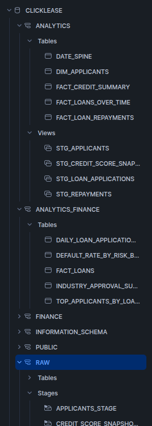
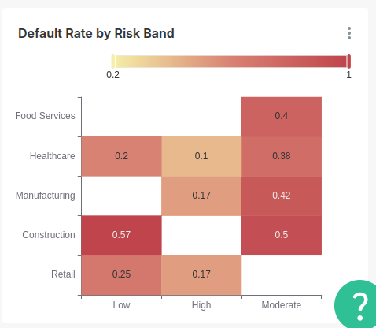
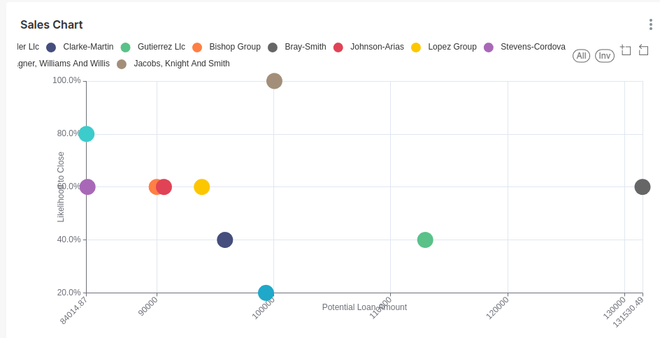

# Clicklease Analytics Demo

This project simulates a high-risk equipment financing analytics platform using **dbt**, **Snowflake**, and **Lightdash**. It models synthetic loan and repayment data to power metrics such as approval rates, default trends, and applicant scoring.

---

## 📦 Tech Stack

- **dbt** – data transformation and warehouse modeling
- **Snowflake** – cloud data warehouse
- **Lightdash** – lightweight open-source BI tool
- **Python** – synthetic data generation
- **Docker Compose** – for local Lightdash setup

---

## 🚀 How to Run

### 1. Generate CSV data

```bash
python generate_data.py
```

This creates synthetic loan + applicant files in `/data`.

### 2. Upload data to Snowflake stage

```bash
snowsql -f scripts/put_files_to_stage.sql
```

### 3. Run dbt models

```bash
dbt run
```

### 4. Launch Lightdash locally

```bash
cd lightdash
docker compose up
```

Visit: [http://localhost:8090](http://localhost:8090)

---

## 🧱 Project Structure

```bash
click_lease/
├── data/                        # Synthetic data files
├── models/                     
│   ├── staging/                # Clean raw data
│   ├── marts/
│   │   └── finance/            # Facts and derived metrics
│   └── util/                   # Date spine, macros
├── seeds/
├── snapshots/
├── macros/
├── lightdash/                  # Docker config
├── dbt_project.yml
├── README.md
```

---
## 🧊 Snowflake Architecture
This project uses a clear layered architecture inside Snowflake, flowing from raw file staging into analytical models.

📸 

---
💾 Data Flow Overview
🔹 RAW (External Stages)
* Purpose: Store raw CSVs in Snowflake internal stages

* How: Files are uploaded using snowsql and PUT commands

* Example Stages:

- `APPLICANTS_STAGE`
- `CREDIT_SCORE_SNAPSHOT_STAGE`
- `LOAN_APPLICATIONS_STAGE`
- `REPAYMENTS_STAGE`

```bash
PUT file://data/applicants.csv @RAW.APPLICANTS_STAGE;
COPY INTO RAW.APPLICANTS FROM @RAW.APPLICANTS_STAGE FILE_FORMAT = (TYPE = CSV ...);
```

ANALYTICS (Core Business Models)
Views: Staging models like STG_APPLICANTS, STG_REPAYMENTS, etc.

Tables: Core data marts like:

- `FACT_LOAN_REPAYMENTS`
- `FACT_CREDIT_SUMMARY`
- `FACT_LOANS_OVER_TIME`
- `DIM_APPLICANTS`
- `DATE_SPINE`

Used for consistent reporting, time-aligned joins, and centralized metrics.

🔹 ANALYTICS_FINANCE (Executive-Level Metrics)
Tables: Summarized KPIs and scorecards, such as:

- `DEFAULT_RATE_BY_RISK_BAND`
- `TOP_APPLICANTS_BY_LOAN_VOLUME`
- `DAILY_LOAN_APPLICATIONS`
- `INDUSTRY_APPROVAL_SUMMARY`

These feed directly into Lightdash dashboards and reflect metrics optimized for decision-making.


## 📊 Dashboards

Preset dashboards include:

### 🔹 Industry Approval Summary

📸


---

### 🔹 Heatmap: Default Rate by Industry × Risk Band

📸 *

---

### 🔹 Top 10 best deals

📸 

---

## 🔍 Data Model Summary

### Staging Models
- `stg_loan_applications`
- `stg_repayments`
- `stg_credit_score_snapshots`

### Fact & Dim Models
- `fact_loans`
- `fact_loan_repayments`
- `dim_applicants`

### Metrics Marts
- `default_rate_by_risk_band`
- `top_applicants_by_loan_volume`
- `industry_approval_summary`

---

## ✅ Data Quality

Implemented with:

- dbt tests (`not null`, `unique`, etc.)
- Expectations for key models
- `date_spine` for complete time series joins

---

## 🧰 Future Enhancements

- Predictive "likelihood to close" scoring
- Historical credit score tracking
- Real-time approvals dashboard
- S3 or external API integration

---

## 👤 Author

**Jake Shivers**  
*Senior Data Engineer & Analytics Leader*  
[GitHub](https://github.com/jakeshivers) • [LinkedIn](https://linkedin.com/in/jakeshivers)
